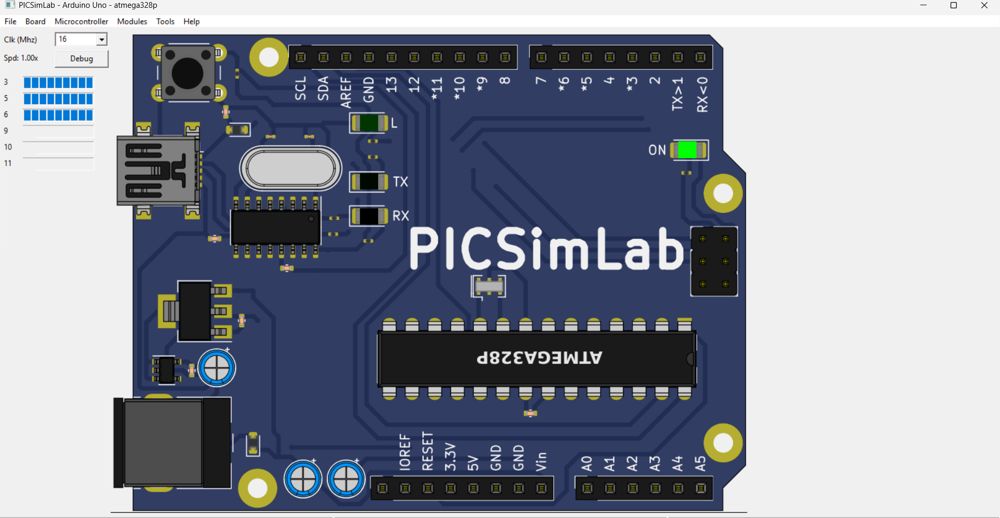
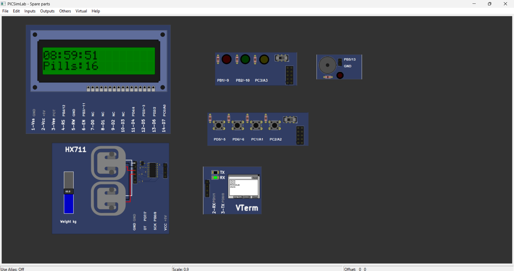
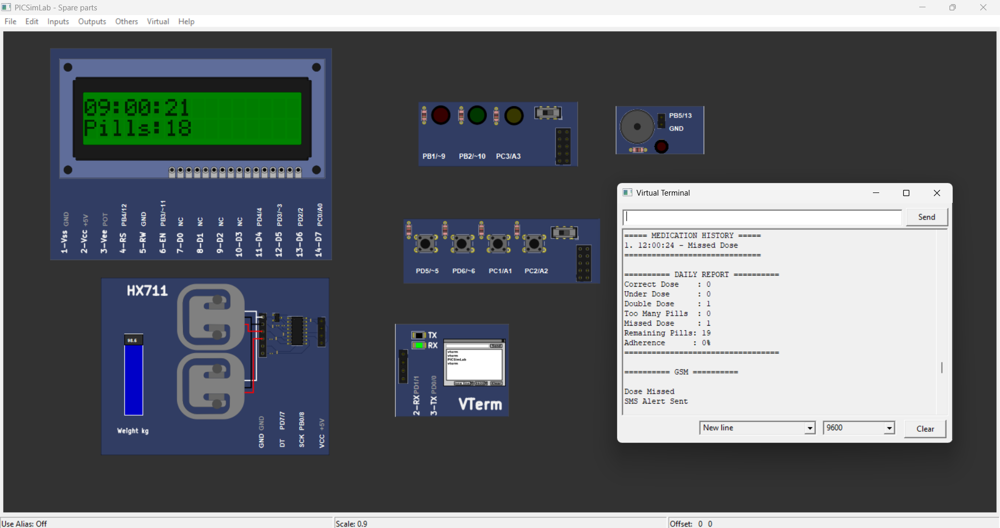
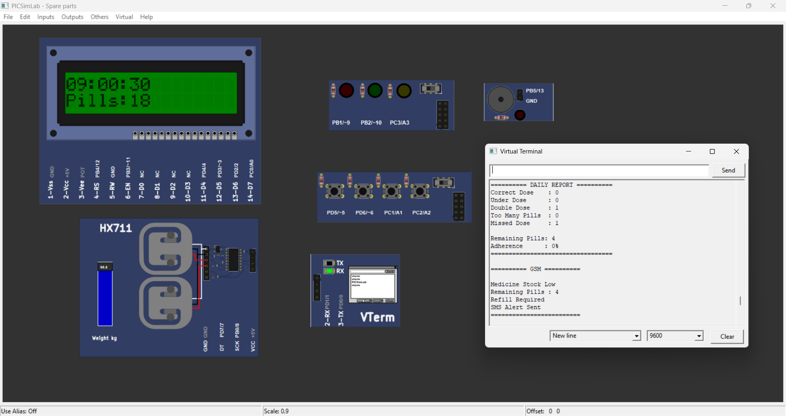
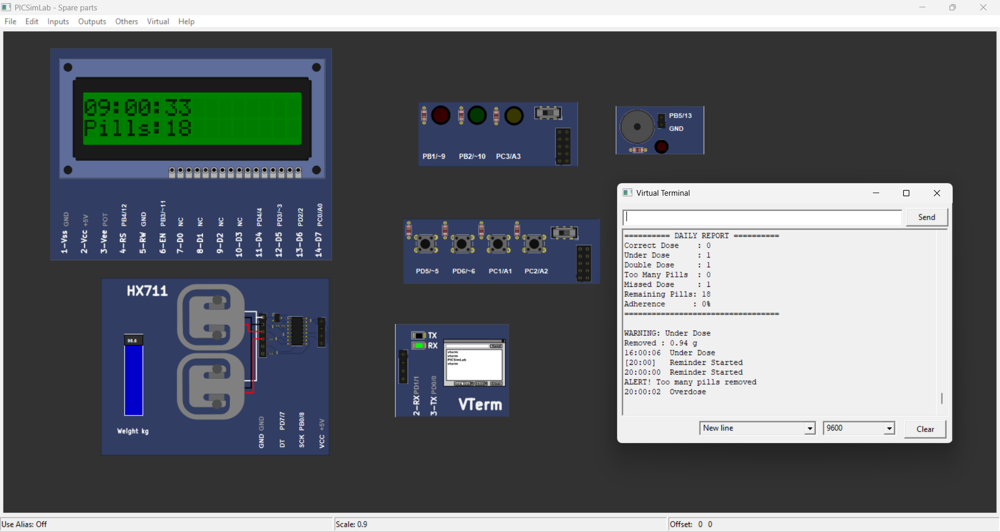

# Smart Pill Box Pro V1

A Smart Medicine Box developed using **Arduino UNO**, **HX711 Load Cell**, and **PICSimLab**. The system reminds users to take medicine on time, detects the amount of medicine removed using weight measurement, maintains medication history, and generates a daily report.

---

## Features

-  Scheduled medicine reminders (9 AM, 12 PM, 4 PM, 8 PM)
-  Weight-based medicine detection using HX711
-  Correct dose detection
-  Under-dose detection
-  Double-dose detection
-  Too many pills detection
-  Low medicine alert
-  Medication history
-  Daily adherence report
-  LED and Buzzer notifications
-  Virtual Terminal monitoring
-  Fully tested in PICSimLab

---

##  Hardware Used

- Arduino UNO
- HX711 Load Cell Module
- Load Cell
- 16x2 LCD
- LEDs
- Buzzer
- Push Buttons

---

##  Software Used

- Arduino IDE
- PICSimLab

---

##  Project Structure

```
Smart-Pill-Box-Pro-V1
│
├── Arduino_Code
│   └── SmartMedicineBoxPro.ino
│
├── PICSimLab
│   ├── SmartMedicine Pro.pzw
│   ├── SmartMedicineBoxPro.ino.hex
│   └── SmartMedicine_Spareparts.pcf
│
├── Images
│
├── LICENSE
└── README.md
```

---

#  Project Screenshots

### Arduino Simulation


### Medicine Initialization


### Take Medicine Reminder


### Low Medicine Alert


### Spare Parts Configuration


### Virtual Terminal Output








---

##  How to Run

1. Open the Arduino code in Arduino IDE.
2. Compile the project.
3. Generate the HEX file.
4. Open the PICSimLab project.
5. Load the HEX file.
6. Run the simulation.
7. Observe LCD, LEDs, buzzer and Virtual Terminal.

---

##  Future Improvements

- ESP8266 Wi-Fi integration
- Mobile App Notifications
- Cloud Database
- Blynk Dashboard
- Caregiver Alerts
- Real-Time Monitoring
- IoT Dashboard

---

##  Author

**Saketh Kumar**

B.Tech Electronics and Communication Engineering

GitHub: https://github.com/SakethKumar-27

---

⭐ If you like this project, don't forget to Star this repository.
